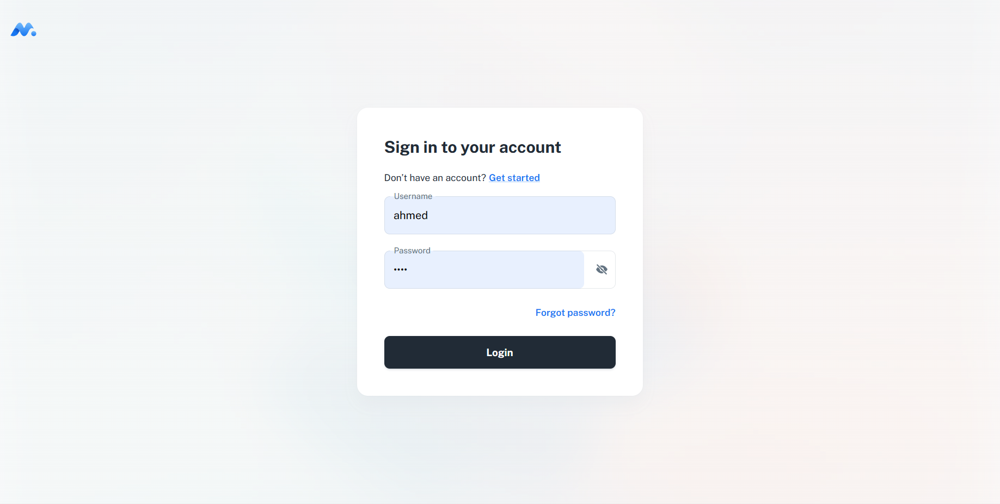
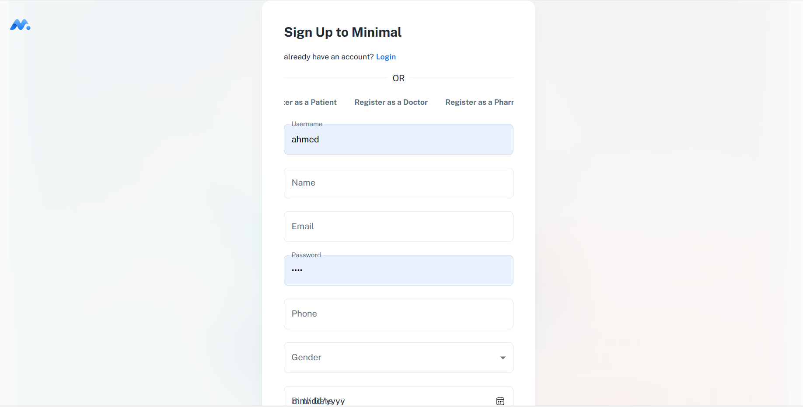
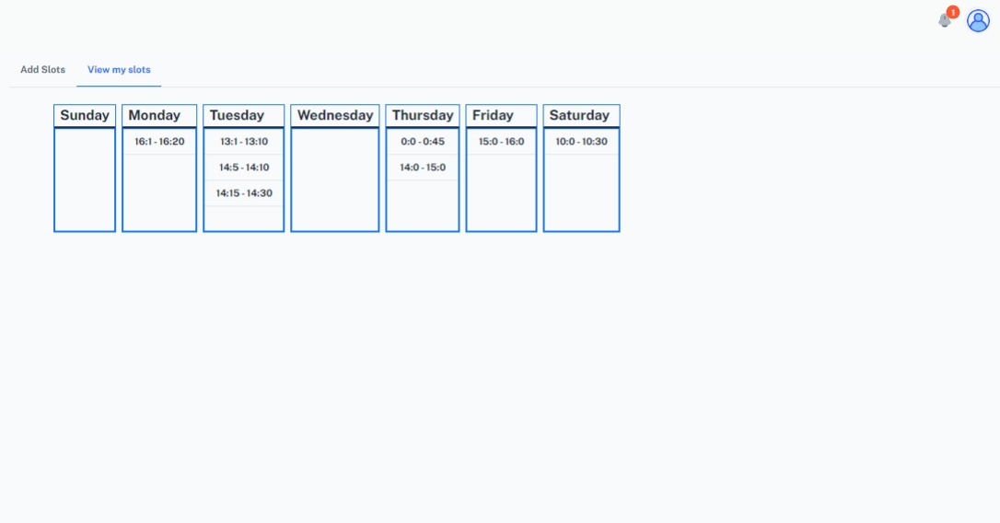
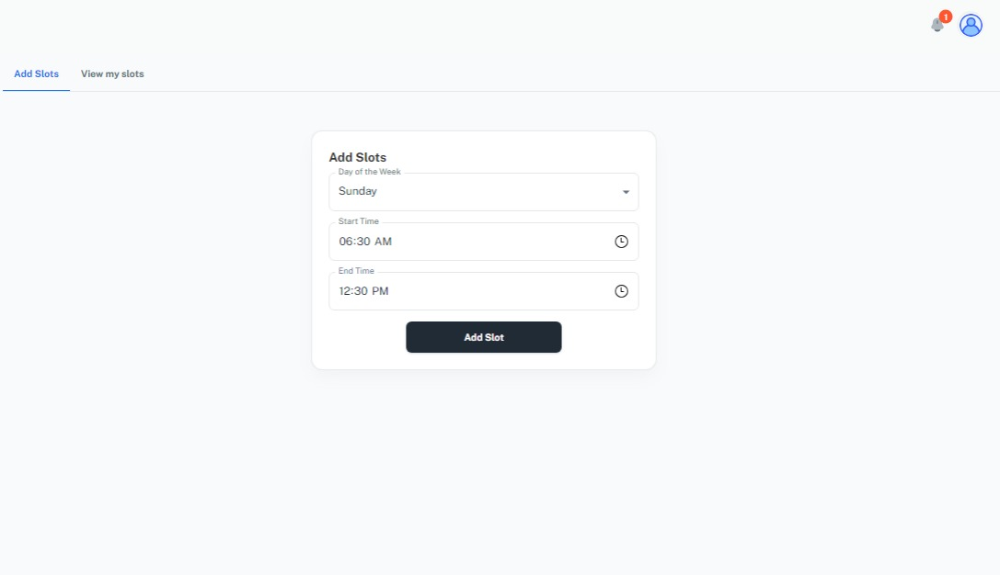
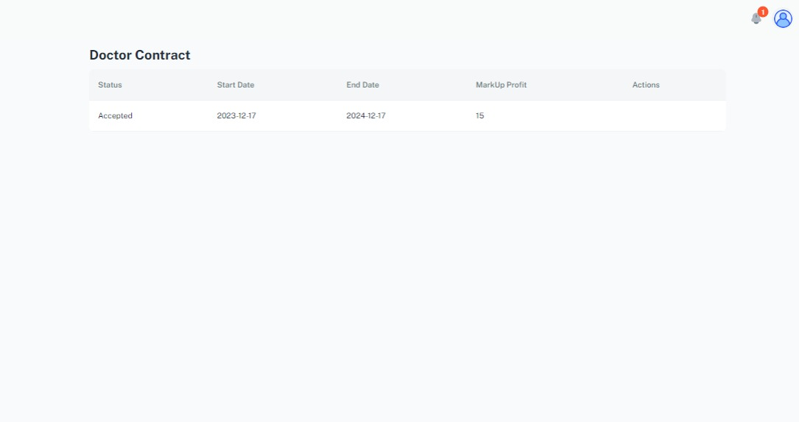
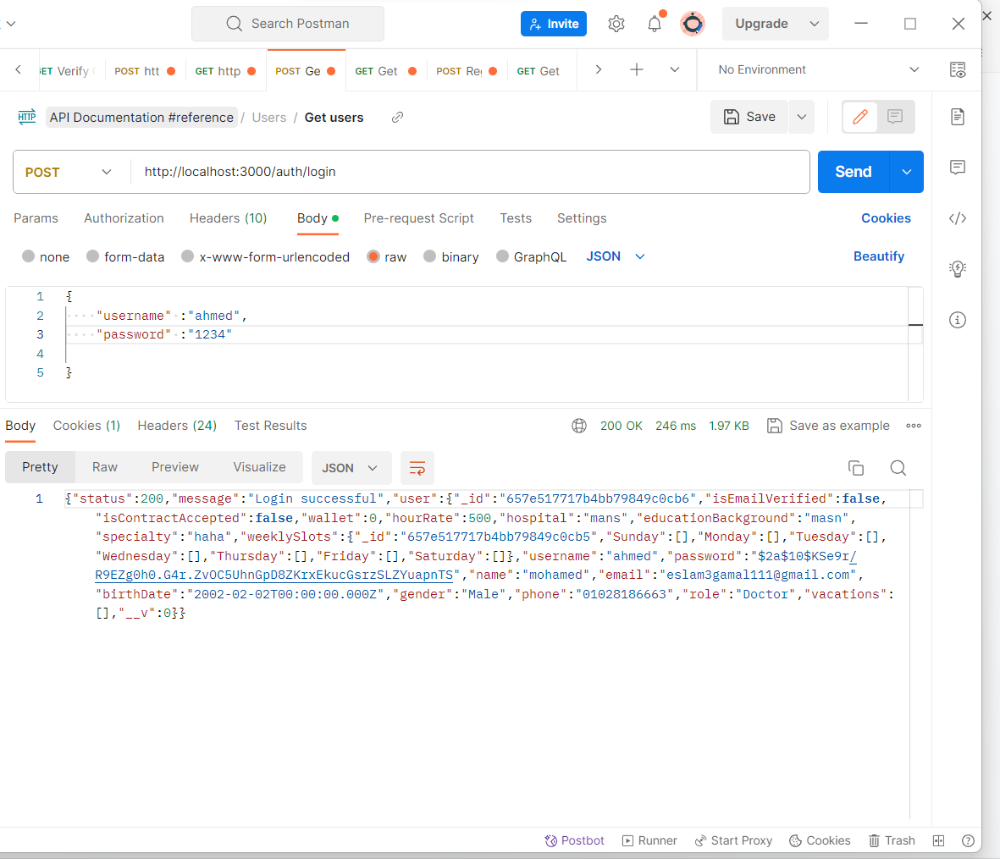
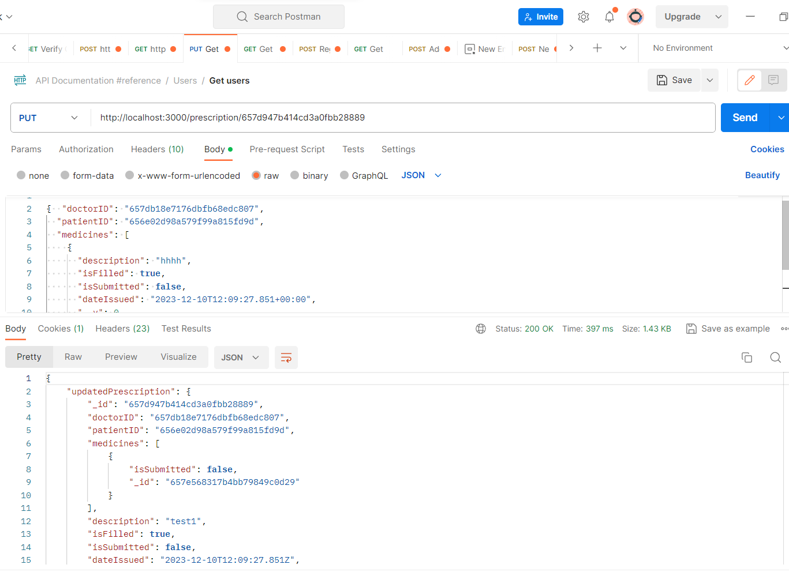
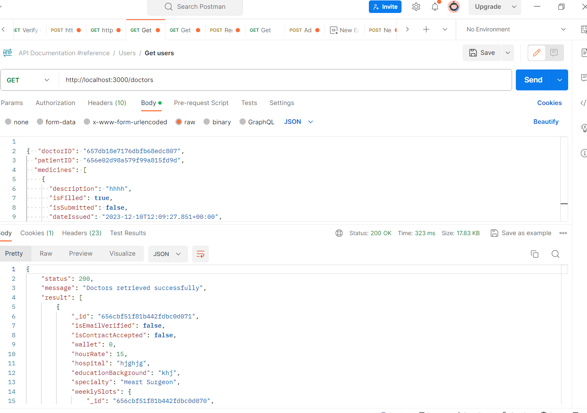
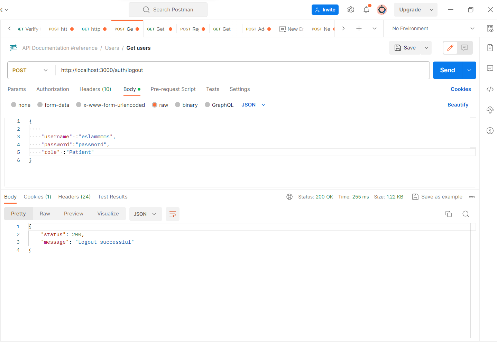

# El7a2ny _Virtual Clinic_
   


Powered by: _Code of Dudty1_

## Table of Contents
- [Project Overview](#project-overview)
- [Motivation](#motivation)
- [Build Status](#build-status)
- [Screenshots](#screenshots)
- [Tech/Framework Used](#techframework-used)
- [Features](#features)
- [Code Style](#code-style)
- [Code Examples](#code-examples)
- [Installation](#installation)
- [How to Use](#how-to-use)
- [Screenshots](#screenshots)
- [API References](#api-references)
- [Tests](#tests)
- [Contribute](#contribute)
- [Credits](#credits)
- [License](#license)


---

## Project Overview
El7a2ny Clinic is a standalone virtual healthcare solution designed to streamline patient-doctor interactions. It is being carried out as part of the German University in Cairo's Media Engineering and Technology curriculum for the Winter 2023 semester. The project, which is overseen by Associate Professor Mervat Abuelkheir, combines a virtual clinic platform with a related pharmacy. Encouraging smooth interactions between medical personnel and patients is one of the main goals. The project includes capabilities including prescription management, appointment scheduling, doctor chatting and calling. This effort, which will be implemented utilizing the MERN Stack, aims to deliver a creative and effective healthcare ecosystem.

---

## Motivation
The deep desire to transform the healthcare experience was the motivation behind the creation of the El7a2ny clinic initiative. Understanding the dynamic nature of healthcare, our goal was to tackle the intricacies involved in the relationships between patients and doctors. The initiative was born out of a desire to make healthcare more accessible and user-friendly by streamlining and automating numerous aspects of the system.

We saw a chance to harness the power of digital solutions to help patients and healthcare providers in a world where technology is essential to improving daily lives. The driving force is the ambition to establish an online clinic ecosystem that crosses conventional lines and provides effective and comprehensive medical treatment.

We hope that this project will help to further the continuing transformation of healthcare delivery. El7a2ny is a symbol of our dedication to creative ideas that can raise people's general quality of life and make healthcare systems more effective.

---

## Build Status 🔨

- The project is currently in development.
- The Unit tests needs modifications.
- A caching layer needs to be added to the application.
- Payment method through Valu and other installment application needs to be added.


---
## Screenshots 🖵


  <details>
    <summary>Upload Images</summary>
     

  </details>

  <details>
    <summary>Sign In</summary>
     

  </details>

  <details>
    <summary>Get Appointment</summary>
     

  </details>

  <details>
    <summary>Sign Up</summary>
     

  </details>

  <details>
    <summary>Get Appointment</summary>
     

  </details>

  <details>
    <summary>Add Doctor available Time slots</summary>

  
  </details>

  <details>
    <summary>Doctor Contract</summary>

 
  </details>

  <details>
    <summary>Text Chat</summary>

   
  </details>

  <details>
    <summary>Reset Password</summary>

   
  </details>


## Tech/Framework Used🧰
In order to provide a reliable and effective virtual clinic solution, the El7a2ny project makes use of a contemporary technology stack. The principal technologies and frameworks integrated into the project are listed below:

- [MongoDB] : A NoSQL database used for storing and managing data.
- [React.js] : A JavaScript library for building user interfaces.
- [node.js] : A runtime environment for executing server-side JavaScript and TypeScript.
- [Express] : A web application framework for building APIs and server-side logic.
- [Mongoose](https://mongoosejs.com/): An elegant MongoDB object modeling tool for Node.js.
- [Jest](https://jestjs.io/): A delightful JavaScript testing framework with a focus on simplicity.
- [Stripe](https://stripe.com/): A technology company that provides payment processing solutions for online businesses.
- [TypeScript](https://www.typescriptlang.org/): A superset of JavaScript that adds static typing and other features.
- [Git](https://git-scm.com/): A distributed version control system for tracking changes in source code.
- [MongoDB Atlas](https://www.mongodb.com/cloud/atlas): A fully managed cloud database service for modern applications.
- [Postman](https://www.postman.com/): A collaboration platform for API development, testing, and management.
- [Visual Studio Code](https://code.visualstudio.com/): A lightweight and powerful code editor with excellent support for various programming languages.

Understanding these tools is essential for contributors and individuals interested in exploring or contributing to the El7a2ny project.


---

## Features✨

1. **Virtual Management:**
   - Schedule and manage appointments with doctors.
   - Find detailed information about available doctors and their specialties.

2. **Doctor Interaction:**
   - Conduct virtual consultations with doctors through the platform.
   - Share and receive medical reports securely.

3. **Video Calls and Chat:**
 - Enable video calls between doctors and patients for face-to-face virtual consultations.
 - Real-time chat feature for additional communication and clarification.

4. **User-Friendly Interface:**
   - Intuitive and easy-to-navigate user interface for a seamless experience.
   - Responsive design for accessibility on various devices.

5. **Secure Data Handling:**
   - Implement robust security measures to ensure the confidentiality of patient and doctor information.
   - Utilize encryption protocols for secure data transmission.

6. **Search and Filter Functionality:**
   - Efficiently search for doctors based on specialization and availability
   - Filter appointments and medication history for quick access.

8. **Real-Time Updates:**
   - Receive real-time updates on appointment status, prescription approvals, and pharmacy order processing.

9. **Scalable Architecture:**
    - Built on the MERN stack (MongoDB, Express.js, React.js, Node.js) for scalability and flexibility.
    - Easily extendable to accommodate future enhancements and features.

These features collectively make El7a2ny a comprehensive and user-centric virtual clinic solution, streamlining the interaction between patients and doctors.

---

## Code Style📜

We maintain a uniform code style throughout this project to make sure it is readable and maintainable. To maintain a uniform and tidy coding structure across the codebase, we use the Prettier code formatter.

A popular code formatter called [Prettier](https://prettier.io/) automatically formats code based on pre-established principles. This makes the development process more efficient and team-oriented by removing the need for developers to manually enforce styling guidelines.

Make sure to run Prettier on your code before submitting a pull request when contributing to this project. This guarantees that the modifications you make comply with the defined coding standards, fostering a unified and harmonious codebase.

Refer to the [official documentation](https://prettier.io/docs/en/install.html) for setup options and installation instructions on how to incorporate Prettier into your development environment. To further automate the formatting process prior to commits, you might find it useful to add Prettier as a pre-commit hook in your version control system.

We hope to improve code readability, streamline collaboration, and enable a more effective development workflow by sticking to a consistent code style with Prettier.

---

## Code Examples 🐱‍💻

***MongoDB Schema for Appointments***
``` bash
 doctorID: {
    type: mongoose.Schema.Types.ObjectId,
    ref: 'User',
    required: true
  },
  patientID: {
    type: mongoose.Schema.Types.ObjectId,
    ref: 'User',
    required: true
  },
  patientName: {
    type: String,
    required: true
  },
  status: { type: String, enum: ['Upcoming', 'Completed', 'Cancelled', 'Rescheduled'], default: 'Upcoming' },
  sessionPrice: { type: Number, required: true },
  startDate: { type: Date, required: true },
  endDate: { type: Date, required: true },
  isFollowUp: { type: Boolean, default: false },
  previousAppointment: { type: mongoose.Schema.Types.ObjectId, ref: 'Appointment', required: false }
});
```
***Express.js Route for getting available appointments***
```bash
router.get('/:id/availableAppointments', isAuthorized('Patient'), (req: Request, res: Response) => {
  controller(res)(viewAvailableAppointments)(req.params.id);
});

```
***React Component for error not found page***
```bash
export default function NotFoundView() {
  const renderHeader = (
    <Box
      component="header"
      sx={{
        top: 0,
        left: 0,
        width: 1,
        lineHeight: 0,
        position: 'fixed',
        p: (theme) => ({ xs: theme.spacing(3, 3, 0), sm: theme.spacing(5, 5, 0) }),
      }}
    >
      <Logo />
    </Box>
  );

  return (
    <>
      {renderHeader}

      <Container>
        <Box
          sx={{
            py: 12,
            maxWidth: 480,
            mx: 'auto',
            display: 'flex',
            minHeight: '100vh',
            textAlign: 'center',
            alignItems: 'center',
            flexDirection: 'column',
            justifyContent: 'center',
          }}
        >
          <Typography variant="h3" sx={{ mb: 3 }}>
            Sorry, page not found!
          </Typography>

          <Typography sx={{ color: 'text.secondary' }}>
            Sorry, we couldn’t find the page you’re looking for. Perhaps you’ve mistyped the URL? Be
            sure to check your spelling.
          </Typography>

          <Box
            component="img"
            src="/assets/illustrations/illustration_404.svg"
            sx={{
              mx: 'auto',
              height: 260,
              my: { xs: 5, sm: 10 },
            }}
          />

          <Button href="/" size="large" variant="contained" component={RouterLink}>
            Go to Home
          </Button>
        </Box>
      </Container>
    </>
  );
}

```

***Node.js Middleware for Authentication:***
```
const isAuthenticated = async (req: Request, res: Response, next: NextFunction) => {
  try {
    const token = req.headers.authorization || req.cookies.token || req.query.token;

    // Verify the JWT token
    const decoded: any = token ? verifyToken(token) : undefined;
    const tokenValid = decoded ? await getRedis(decoded.id) : undefined;

    if (tokenValid) {
      req.decoded = decoded; // Store the decoded user information in the request
      return next();
    }

    res.status(StatusCodes.UNAUTHORIZED).json({ message: 'Not authenticated' });
  } catch (error: any) {
    console.error(error);
    res.status(StatusCodes.INTERNAL_SERVER_ERROR).json({ error: error.message });
  }
};
```

***Node.js service for getting a doctor's patients***

```bash
const getMyPatients = async (query: any) => {
  const patientIDs = await Appointment.find(query).distinct('patientID');
  if (!patientIDs) return new HttpError(StatusCodes.NOT_FOUND, 'No patients with this doctor');

  const patients = await Patient.find({ _id: { $in: patientIDs } });

  return {
    status: StatusCodes.OK,
    message: 'Patients retrieved successfully',
    result: patients
  };
};
```

---


## Installation📥

**Install the dependencies for the clinic webapp**
```sh
git clone https://github.com/advanced-computer-lab-2023/Code-of-Duty1-Clinic.git
cd server
npm install
cd ../client
npm install
```

 **Set Up Environment Variables:**
   - Create a `.env` file in the root of the project.
   - Add the necessary environment variables, such as database connection strings, API keys, etc.

---

## How to Use

Follow these steps to run the El7a2ny project on your local machine:
1. **To run backend**
   ```bash
   cd server && npm run start
   ```
2. **To run frontend**
   ```bash
   cd ../client && npm run dev
   ```

3. **Access the Application:**
   Open your web browser and go to [http://localhost:3000](http://localhost:3000) to access the El7a2ny project.
**(The backend server and client will be running on the specified ports on your env files ,so 3000 could change depends on the user).**
4. **Interact with the Features:**
   Explore the virtual clinic features, schedule appointments, view medical history, and more.

---

## Screenshots🖵

-
-
-
-

---
## API References

In the El7a2ny project, we have implemented a range of API routes to ensure smooth functionality and interaction within our application. These routes are categorized as follows:

- **Auth Routes**: Handling user authentication processes like registration, login, password recovery, etc.
- **Doctor Routes**: Facilitating interactions with doctor profiles, including appointments and availability.
- **Me Routes**: Personalized routes for users, managing their information, appointments, medical history, etc.
**Patient Routes**: Pertaining to patient information, medical records, and related functionalities.
- **Payment Routes**: Handling payment processes, including transaction management and payment session initiation.
- **Prescription Routes**: Dealing with prescription management, including adding, updating, and removing medicines.
- **User Routes**: Managing user profiles, including user data retrieval and updates.


For detailed information on each API route, please refer to our [API Reference Documentation](refrence.md).


---

## Tests

In the development of the El7a2ny project, testing plays a crucial role in ensuring the reliability and functionality of our application. We employ a combination of Postman and Jest to comprehensively cover different aspects of testing.

### Postman for Backend Testing
For backend testing, we extensively use Postman. It is a vital tool in our development process for:

- Validating the functionality of our API endpoints.
- Ensuring responses and payloads are accurate and as expected.
- Facilitating the creation and execution of test suites for various API routes, enhancing the consistency and reliability of our backend services.

### Jest for Partial Testing
While Jest, a delightful JavaScript testing framework, is utilized in our project, it's important to note that not all components and functionalities are currently covered by Jest tests. However, we have integrated some Jest tests which are instrumental in:

- Validating the logic of individual components and functions.
- Ensuring key functionalities perform as intended.
- Offering a foundation for future comprehensive test coverage as the project evolves.

### Running the Tests
To execute the tests, follow these guidelines:

**For Postman:**
- Make sure your local server or the relevant environment is running.
- Any route from our API Refrence file can be used for testing, 
for example: you can use the route "http://localhost:3000/me/wallet" to get the user's wallet info
- Execute the tests within each collection to validate the backend API functionality.

**For Jest:**
- Navigate to the root directory of the project.
- Run `npm test` to execute the available Jest test suites.

Our approach to testing, combining Postman for backend APIs and Jest for specific components, aims to strike a balance between thorough validation and development agility. Future iterations of the project will likely expand on the Jest test coverage for a more comprehensive testing suite.

---

## Contribute

We welcome contributions from the community to enhance the project. If you'd like to contribute, follow these steps:

1. **Fork the Repository:**
   Click the "Fork" button on the top right corner of the repository's GitHub page. This will create a copy of the repository in your GitHub account.

2. **Clone Your Fork:**
   ```bash
   git clone https://github.com/advanced-computer-lab-2023/Code-of-Duty1-Clinic 
   ```

3. **Create a Branch:**
   ```bash
   cd server
   git checkout -b feature/your-feature
   ```

4. **Make Changes:**
   Make the necessary changes and improvements in your feature branch.

5. **Commit Changes:**
   ```bash
   git add .
   git commit -m "Add your concise commit message here"
   ```

6. **Push Changes:**
   ```bash
   git push origin feature/your-feature
   ```

7. **Submit a Pull Request:**
   Go to the GitHub page of your forked repository. Click on the "New Pull Request" button and submit your changes for review.

8. **Participate in Discussions:**
   Engage in discussions, provide feedback, and address any feedback received during the review process.

By following these steps, you contribute to the improvement of the project. Thank you for your valuable contribution!

---

## Credits

- [Abdulrahman Fahmy](https://www.linkedin.com/in/abdulrhman-fahmy) 
- [Alaa Hisham](https://www.linkedin.com/in/alaahisham) 
- [Zeyad Hesham](https://www.linkedin.com/in/zeyad-hesham-174941242/) 
- [Ali Hussein](https://www.linkedin.com/in/ali-adam-875653245)
- [Abdallah Bahaa](http://linkedin.com/in/abdallah-khalil-a06237240)
- [Mark Mahrous](https://www.linkedin.com/in/mark-mahrous-421186222/)
- [Eslam Gamal](https://www.linkedin.com/in/eslam-gamal-895350204)
- [Yousef Badr](https://www.linkedin.com/in/yousef-badr-81197629b/)
- [Boles waheed](https://www.linkedin.com/in/boles-waheed-b9529622b)
- [Traversy media yt channel](https://www.youtube.com/watch?v=-0exw-9YJBo&list=PLillGF-RfqbbQeVSccR9PGKHzPJSWqcsm) short mern stack playlist helped us alot!

---

## License

This project is dual-licensed under both the MIT License and the Apache License 2.0. Depending on your use case, you may choose to comply with the terms of either license.

- The **MIT License** is a permissive license that is short and to the point. It lets people do almost anything they want with your project, like making and distributing closed source versions, as long as they provide attribution back to you and don’t hold you liable.

- The **Apache License 2.0** also provides an express grant of patent rights from contributors to users. It is a permissive license, similar to the MIT License, but also provides an express grant of patent rights from contributors to users.

For more details, see the [LICENSE-MIT](LICENSE-MIT) and [LICENSE-APACHE](LICENSE-APACHE) files in this repository.


---

[//]: # (These are reference links used in the body of this note and get stripped out when the markdown processor does its job. There is no need to format nicely because it shouldn't be seen. Thanks SO - http://stackoverflow.com/questions/4823468/store-comments-in-markdown-syntax)
[MongoDB]: <https://www.mongodb.com/>
[React.js]: <https://react.dev/>
   [node.js]: <http://nodejs.org>
   [express]: <http://expressjs.com>
   [AngularJS]: <http://angularjs.org>


